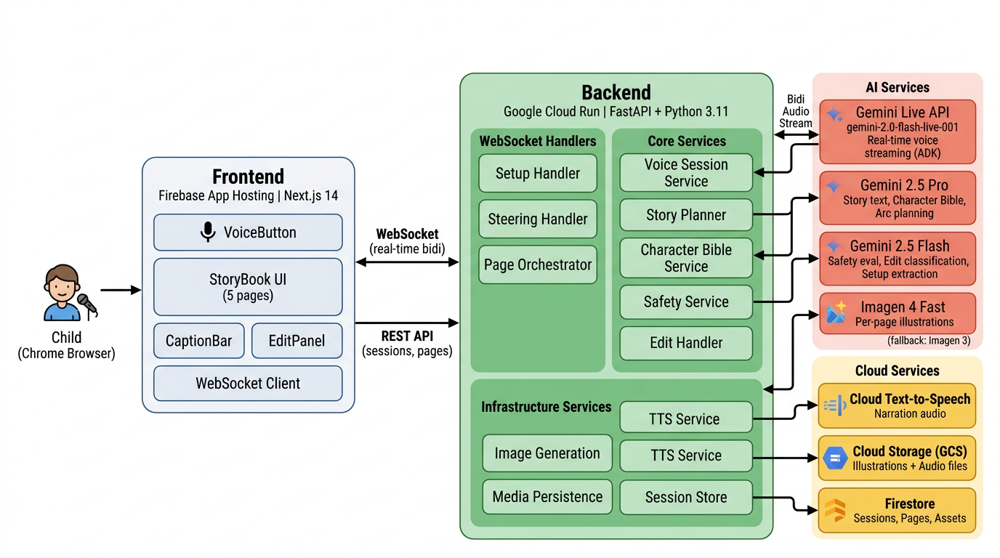
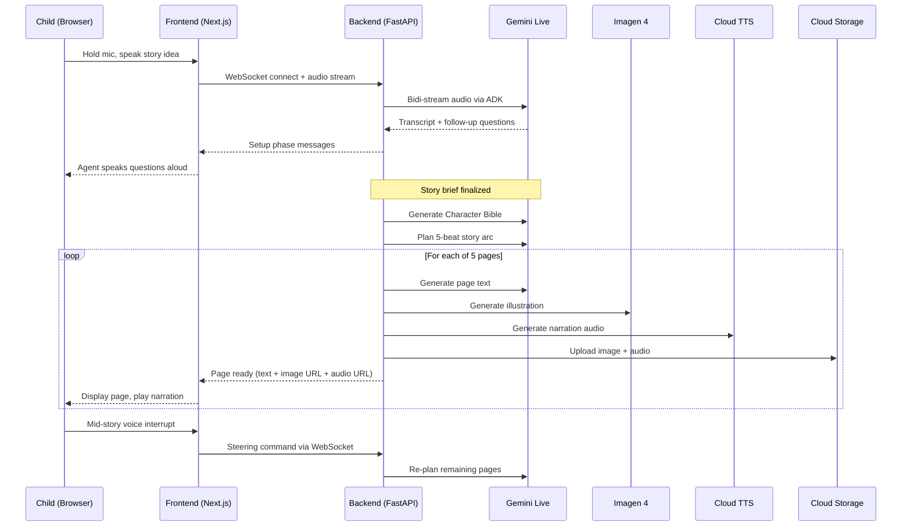

# Voice Story Agent for Children

A real-time, voice-powered AI storytelling agent that turns a child's spoken idea into a fully illustrated 5-page storybook — complete with consistent characters, per-page narration audio, and the ability to steer the story mid-flow using voice.

**Hackathon**: [Gemini Live Agent Challenge](https://geminiliveagentchallenge.devpost.com/) — *Redefining Interaction: From Static Chatbots to Immersive Experiences*
**Category**: Creative Storyteller

> A child holds the microphone and says *"Tell me a story about a little purple monster who makes too much noise."* The agent listens, asks a few follow-up questions (*What's the monster's name? Where does it live?*), then generates five illustrated pages one by one — each with story text, an AI-generated illustration, and spoken narration. Halfway through, the child interrupts: *"Give the monster a tiny yellow bird friend!"* The agent re-plans the remaining pages, and the bird appears with visual consistency across every subsequent illustration.

Key highlights:

- **Voice-first** — children speak naturally; no typing required.
- **Child-safe** — a content safety layer intercepts harmful prompts and proposes age-appropriate rewrites before proceeding.
- **Consistent characters** — a Character Bible derived from the story brief ensures the protagonist looks the same on every page.
- **Live steering** — interrupt narration at any point to add characters, change the setting, or redirect the plot.

---

## Architecture



---

## How It Works



### Example Session

1. **Child speaks**: *"A story about a brave robot cat who explores the ocean."*
2. **Agent asks**: *"What's the robot cat's name? Is this a funny story or an adventure?"*
3. **Child answers**: *"Her name is Sparky, and it's an adventure!"*
4. **Page 1 generates**: Story text appears, then the illustration loads, then narration plays aloud.
5. **Child interrupts during page 2**: *"Add a friendly octopus named Bubbles!"*
6. **Pages 3–5** seamlessly include Bubbles the octopus alongside Sparky, with both characters visually consistent across every illustration.

**Safety in action**: If a child says *"A story where the dragon destroys the whole city,"* the agent proposes a safe alternative aloud — *"How about the dragon accidentally melts some ice cream instead?"* — and waits for acknowledgement before proceeding.

---

## Tech Stack

| Layer | Technology | What It Does |
|---|---|---|
| **Backend** | FastAPI + uvicorn | REST API endpoints + WebSocket server for real-time communication |
| **Language** | Python 3.11 | Backend runtime |
| **Voice AI** | Gemini Live API (`gemini-2.0-flash-live-001`) via Google ADK | Real-time bidirectional voice streaming — listens and responds naturally |
| **Story Generation** | Gemini 2.5 Pro + Flash | Plans the story arc, generates page text, derives the character bible |
| **Image Generation** | Imagen 4 Fast (fallback: Imagen 3) | Creates per-page illustrations matching the character bible |
| **Narration** | Google Cloud Text-to-Speech | Converts page text into child-friendly spoken narration |
| **Storage** | Google Cloud Storage (GCS) | Stores generated illustrations and audio files |
| **Database** | Firestore (Native mode) | Persists sessions, pages, and asset metadata |
| **Frontend** | Next.js 14 (App Router) + React 18 | Interactive storybook UI with hold-to-talk voice button |
| **Styling** | Tailwind CSS | Responsive, modern design |
| **Frontend Hosting** | Firebase App Hosting | Native Next.js SSR hosting with auto-deploy |
| **Backend Hosting** | Google Cloud Run | Containerized, autoscaling backend with WebSocket support |
| **CI/CD** | GitHub Actions | Auto-deploys backend to Cloud Run on push to `main` |

---

## Project Structure

```
voice-story-agent/
├── backend/                    # FastAPI service (deploys to Cloud Run)
│   ├── app/
│   │   ├── main.py             # FastAPI entrypoint, CORS, routers
│   │   ├── config.py           # Pydantic-Settings config + GCP client factories
│   │   ├── routers/            # REST endpoints (sessions, pages)
│   │   ├── services/           # Core logic (ADK voice, story planner, image gen, TTS, safety)
│   │   ├── models/             # Data models (session, page, character bible, edits)
│   │   └── websocket/          # WebSocket handlers (setup, steering, page orchestration)
│   ├── Dockerfile              # Multi-stage Python 3.11-slim build
│   ├── requirements.txt
│   └── .env.example            # All config variables with defaults
├── frontend/                   # Next.js 14 app (deploys to Firebase App Hosting)
│   ├── src/
│   │   ├── app/                # Next.js pages (landing, story view)
│   │   ├── components/         # StoryBook, StoryPage, VoiceButton, CaptionBar, EditPanel
│   │   ├── hooks/              # useVoiceSession, useStoryState
│   │   └── lib/                # WebSocket client + message types
│   ├── apphosting.yaml         # Firebase App Hosting config
│   └── package.json
├── infra/                      # GCP provisioning scripts
│   ├── setup.sh                # One-command infra setup
│   ├── cloud-run-deploy.sh
│   └── firebase-deploy.sh
└── .github/workflows/
    └── deploy-backend.yml      # CI/CD pipeline
```

---

## Setup Guide

All AI features (Gemini, Imagen, TTS) require Google Cloud APIs, so this project must be deployed to Google Cloud to function. Follow the steps below.

### Prerequisites

| Tool | Version | Install |
|------|---------|---------|
| Python | 3.11+ | `brew install python@3.11` or [python.org](https://www.python.org/) |
| Node.js | 20 LTS+ | `brew install node` or [nodejs.org](https://nodejs.org/) |
| gcloud CLI | latest | [cloud.google.com/sdk/docs/install](https://cloud.google.com/sdk/docs/install) |
| Docker | latest | [docs.docker.com/get-docker](https://docs.docker.com/get-docker/) |
| Firebase CLI | latest | `npm install -g firebase-tools` |

---

### Step 1 — Create a Google Cloud Project

1. Go to [console.cloud.google.com](https://console.cloud.google.com/) and create a new project (or select an existing one).
2. Note your **Project ID** (e.g., `my-story-agent`). You will use it throughout.
3. **Enable billing** on the project — required for Vertex AI, Cloud Run, and Cloud Storage.

---

### Step 2 — Install and Configure the Cloud SDK

```bash
# Authenticate with your Google account
gcloud auth login

# Set your project as the active project
gcloud config set project YOUR_PROJECT_ID

# Set up Application Default Credentials
gcloud auth application-default login
```

---

### Step 3 — Provision Cloud Infrastructure

The included setup script enables all required APIs and creates every resource the app needs. It is safe to re-run.

```bash
cd voice-story-agent

chmod +x infra/setup.sh
./infra/setup.sh YOUR_PROJECT_ID
```

This single command:
- **Enables GCP APIs**: Firestore, Cloud Storage, Vertex AI, Text-to-Speech, Cloud Run, Firebase, Cloud Build, Logging
- **Creates a Firestore database** in Native mode (`us-central1`)
- **Creates a GCS bucket** named `YOUR_PROJECT_ID-story-assets`
- **Creates a service account** `voice-story-agent-sa@YOUR_PROJECT_ID.iam.gserviceaccount.com`
- **Grants IAM roles**: `datastore.user`, `storage.objectAdmin`, `aiplatform.user`, `logging.logWriter`, `cloudtexttospeech.serviceAgent`
- **Downloads a service account key** to `.credentials/sa-key.json` (git-ignored)

After the script completes, update `backend/.env`:

```bash
cp backend/.env.example backend/.env
```

Set these two values:
```
GCP_PROJECT_ID=your-project-id
GCS_BUCKET_NAME=your-project-id-story-assets
```

All other variables in `.env` have sensible defaults (model versions, TTS voice, region, etc.).

---

### Step 4 — Deploy Backend to Cloud Run

#### 4a. Build and push the Docker image

```bash
cd backend

gcloud builds submit --tag gcr.io/YOUR_PROJECT_ID/voice-story-agent-backend
```

#### 4b. Deploy to Cloud Run

```bash
gcloud run deploy voice-story-agent-backend \
  --image gcr.io/YOUR_PROJECT_ID/voice-story-agent-backend \
  --region us-central1 \
  --allow-unauthenticated \
  --session-affinity \
  --timeout=300 \
  --min-instances=1 \
  --max-instances=10 \
  --memory=512Mi \
  --concurrency=80 \
  --set-env-vars GCP_PROJECT_ID=YOUR_PROJECT_ID,GCS_BUCKET_NAME=YOUR_PROJECT_ID-story-assets \
  --service-account voice-story-agent-sa@YOUR_PROJECT_ID.iam.gserviceaccount.com
```

Note the **Cloud Run service URL** from the output (e.g., `https://voice-story-agent-backend-xxx-uc.a.run.app`).

#### 4c. Verify the backend

```bash
curl https://YOUR_CLOUD_RUN_URL/health
# → {"status": "ok"}
```

---

### Step 5 — Set Up Firebase and Deploy Frontend

#### 5a. Initialize Firebase

```bash
firebase login
firebase init apphosting    # Select your GCP project; link to your repo
```

#### 5b. Configure backend URL

Set the backend URL so the frontend knows where to send requests. Either update `frontend/apphosting.yaml`:

```yaml
env:
  - variable: NEXT_PUBLIC_API_BASE_URL
    value: https://voice-story-agent-backend-xxx-uc.a.run.app
  - variable: NEXT_PUBLIC_WS_BASE_URL
    value: wss://voice-story-agent-backend-xxx-uc.a.run.app
```

Or set them in the **Firebase Console** under App Hosting → Environment variables.

#### 5c. Deploy

Push to the connected Git branch to trigger an automatic build and deploy:

```bash
git push origin main
```

The App Hosting URL will appear in the Firebase Console (e.g., `https://your-project.web.app`).

#### 5d. Update CORS on Cloud Run

Allow the frontend to reach the backend:

```bash
gcloud run services update voice-story-agent-backend \
  --region us-central1 \
  --update-env-vars CORS_ORIGINS=https://your-project.web.app
```

---

### Step 6 — Verify End-to-End

```bash
# Health check
curl https://YOUR_CLOUD_RUN_URL/health

# Create a test session
curl -X POST https://YOUR_CLOUD_RUN_URL/sessions
# → {"session_id": "...", "ws_url": "wss://..."}
```

Then open your Firebase App Hosting URL in **Chrome** (required for WebAudio + microphone API):

1. Grant microphone permission when prompted.
2. Hold the mic button and say: *"Tell me a story about a brave little fox who finds a hidden garden."*
3. Answer the agent's follow-up questions.
4. Watch all 5 pages generate — text, illustration, then narration for each.
5. During narration, interrupt with a voice command to steer the story.

---

## Environment Variables Reference

| Variable | Default | Description |
|---|---|---|
| `GCP_PROJECT_ID` | *(required)* | Your Google Cloud project ID |
| `GCP_REGION` | `us-central1` | Region for Vertex AI and regional services |
| `GCS_BUCKET_NAME` | *(required)* | GCS bucket name for illustrations and audio |
| `FIRESTORE_DATABASE` | `(default)` | Firestore database ID |
| `GEMINI_PRO_MODEL` | `gemini-2.5-pro` | Model for story generation |
| `GEMINI_FLASH_MODEL` | `gemini-2.5-flash` | Model for fast inference |
| `GEMINI_LIVE_MODEL` | `gemini-2.0-flash-live-001` | Model for bidi-streaming voice |
| `IMAGEN_MODEL` | `imagen-4.0-fast-generate-001` | Model for illustration generation |
| `IMAGEN_FALLBACK_MODEL` | `imagen-3.0-generate-002` | Fallback illustration model |
| `TTS_VOICE_NAME` | `en-US-Neural2-F` | Cloud TTS voice for narration |
| `TTS_LANGUAGE_CODE` | `en-US` | Language code for TTS |
| `ADK_AGENT_NAME` | `voice-story-agent` | Agent label used in logging |
| `CORS_ORIGINS` | `http://localhost:3000` | Comma-separated allowed CORS origins |

---

## Troubleshooting

| Symptom | Likely Cause | Fix |
|---------|-------------|-----|
| No microphone access | Browser permission denied | Enable mic in Chrome site settings |
| WebSocket connects then immediately closes | CORS misconfigured | Verify `CORS_ORIGINS` env var matches your frontend URL |
| Imagen returns 403 | Service account missing role | Re-run IAM grant: `gcloud projects add-iam-policy-binding` for `roles/aiplatform.user` |
| TTS returns empty audio | Voice name not available in region | Change `TTS_VOICE_NAME` to `en-US-Wavenet-F` |
| Cloud Run cold start on first request | `--min-instances` not set | Set `--min-instances=1` in deploy command |
| Page image fails silently | GCS bucket CORS not configured | Run `gcloud storage buckets update gs://... --cors-file=cors.json` |
| ADK session drops mid-conversation | Cloud Run default timeout (60s) hit | Set `--timeout=300` on Cloud Run |

---

## Observability

View structured logs for a specific session:

```bash
gcloud logging read \
  'jsonPayload.session_id="YOUR_SESSION_ID"' \
  --project=YOUR_PROJECT_ID \
  --limit=100 \
  --format=json | jq '.[] | {time: .timestamp, event: .jsonPayload.event, page: .jsonPayload.page}'
```

Key log events to look for after a demo run:
```
session_created → setup_complete → safety_triggered (if applicable)
→ page_generation_started (x5) → page_complete (x5) → story_complete
```
